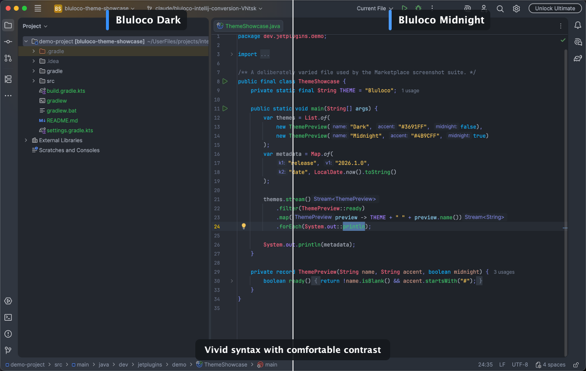
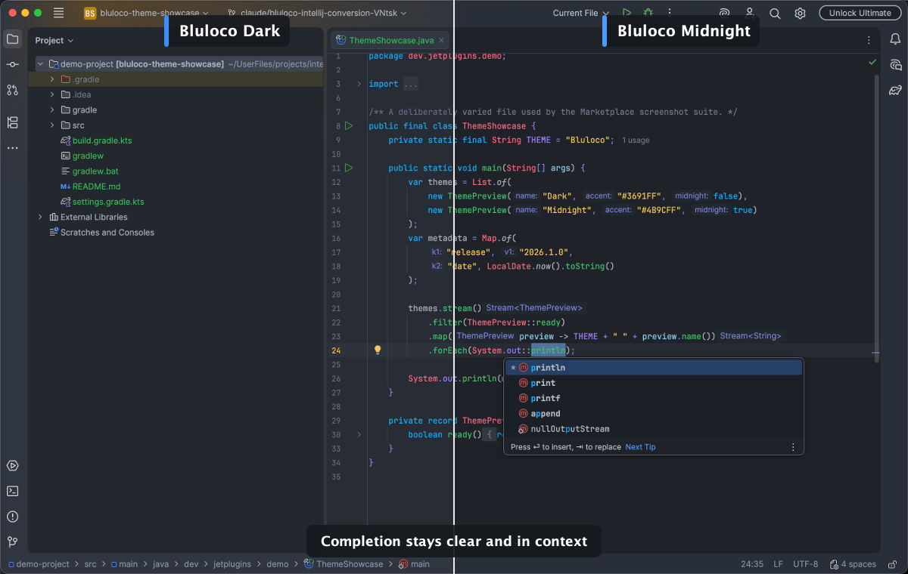

# Bluloco Dark Theme for IntelliJ


Bring Bluloco's vivid syntax colors and deep charcoal backgrounds to the modern IntelliJ Islands UI.
Choose the balanced Dark theme or the lower-glare Midnight variant.

<!-- Plugin description -->
Bluloco brings vivid, easy-to-scan syntax colors to the modern IntelliJ Islands UI.

Choose **Bluloco Dark** for the original balanced charcoal appearance, or **Bluloco Midnight** for a deeper canvas with quieter IDE chrome. Both variants are designed to keep code prominent while preserving clear separation between editors, tool windows, popups, and navigation.

Based on the popular [Bluloco Dark](https://marketplace.visualstudio.com/items?itemName=uloco.theme-bluloco-dark) VS Code theme by Umut Topuzoğlu and carefully adapted for IntelliJ-based IDEs.

This is a paid plugin available on the [JetBrains Marketplace](https://plugins.jetbrains.com).

**Features:**

- Two complete themes: balanced Bluloco Dark and deeper Bluloco Midnight
- Purposeful syntax colors that make keywords, types, functions, strings, and values easy to distinguish
- Native Islands styling with layered work areas, rounded surfaces, and a clear active tab
- Coordinated action, object, and checkbox icons using Bluloco accent colors
- Consistent colors across the editor, completion popups, settings, tool windows, terminal, VCS, and diff views
- Broad language support, including Java, Kotlin, Python, JavaScript, TypeScript, HTML, CSS, JSON, YAML, Markdown, and SQL
<!-- Plugin description end -->

## Theme Variants

- **Bluloco Dark** keeps the original theme's charcoal canvas and vivid syntax palette while adopting the softer, layered Islands UI.
- **Bluloco Midnight** uses a deeper editor canvas and quieter chrome for stronger focus, while sharing the same language coverage and Bluloco accents.

## Dark vs Midnight

The Marketplace assets are captured from a real IntelliJ sandbox through Remote Robot, not from a static mockup.





## Bluloco Dark Color Palette

| Element              | Color                                                       |
|----------------------|-------------------------------------------------------------|
| Background           | `#282c34`  |
| Foreground           | `#abb2bf`  |
| Comment              | `#636d83`  |
| Keyword              | `#10b1fe`  |
| Function             | `#3fc56b`  |
| String               | `#f9c859`  |
| Number               | `#ff78f8`  |
| Constant             | `#9f7efe`  |
| Class/Type           | `#ff6480`  |
| Property             | `#ce9887`  |
| Tag                  | `#3691ff`  |
| Attribute            | `#ff936a`  |
| Operator/Punctuation | `#7a82da`  |
| Parameter            | `#8bcdef`  |

## Installation

- Using the IDE built-in plugin system:

  <kbd>Settings/Preferences</kbd> > <kbd>Plugins</kbd> > <kbd>Marketplace</kbd> > <kbd>Search for "Bluloco Dark Theme"</kbd> >
  <kbd>Install</kbd>

- Manually:

  Download the [latest release](https://github.com/Jetplugins/intellij-bluloco-dark-theme/releases/latest) and install it manually using
  <kbd>Settings/Preferences</kbd> > <kbd>Plugins</kbd> > <kbd>⚙️</kbd> > <kbd>Install plugin from disk...</kbd>

## Development

The editor schemes are generated into `build/generated/theme-resources` from
`src/main/theme/BlulocoScheme.xml.template` and `src/main/theme/editor-schemes.json`.

```bash
./gradlew check buildPlugin
```

To launch IntelliJ, discover every registered theme, assert its live UI colors, and regenerate the sample-code artwork and five Marketplace comparisons:

```bash
./gradlew createScreenshots
```

`createScreenshots` is supported on macOS and Linux. It writes annotated 1200 × 760 theme artwork to `marketplace/screenshots/themes`, while raw UI states and all-theme comparisons are generated alongside it. Run `./gradlew createMarketplaceMedia` to also create the 13-second Marketplace demo video (requires `ffmpeg`). The dedicated GitHub Actions workflow runs the same Robot assertions on macOS, Linux, and Windows and uploads the raw captures as build artifacts.

### Release automation

Every push creates a fresh draft GitHub release for the version in `gradle.properties`, including the built plugin ZIP. Publishing that draft triggers the lightweight JetBrains Marketplace workflow without running Plugin Verifier.

Configure the `PUBLISH_TOKEN` repository secret before publishing.

## Credits

- Original VS Code theme: [Bluloco Dark](https://github.com/uloco/theme-bluloco-dark) by [Umut Topuzoğlu](https://github.com/uloco)
- IntelliJ plugin based on the [IntelliJ Platform Plugin Template](https://github.com/JetBrains/intellij-platform-plugin-template)
